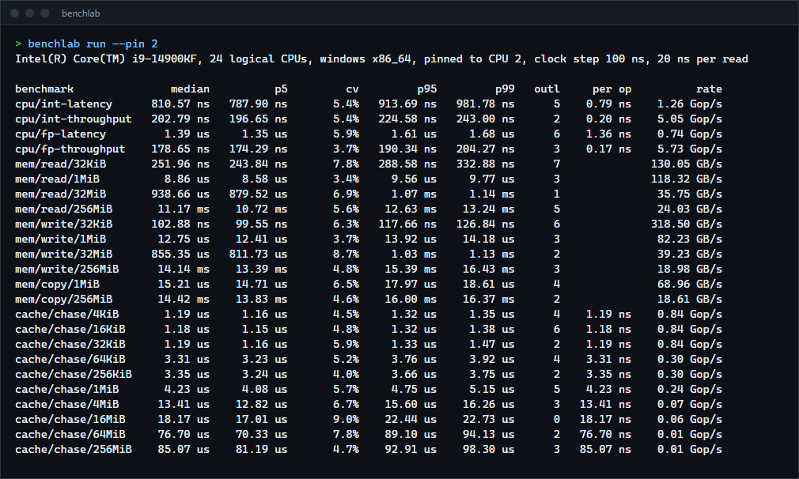
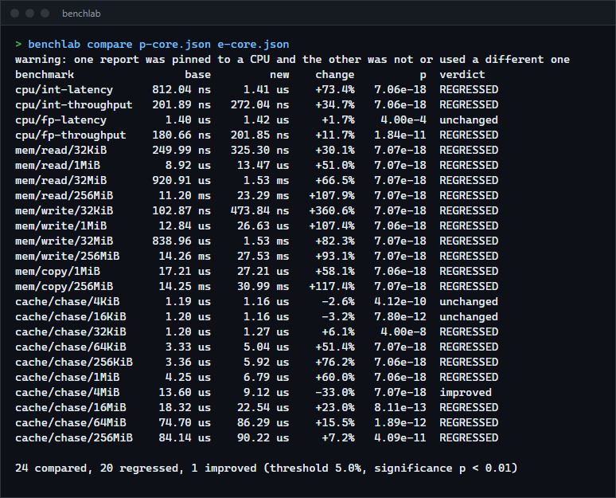
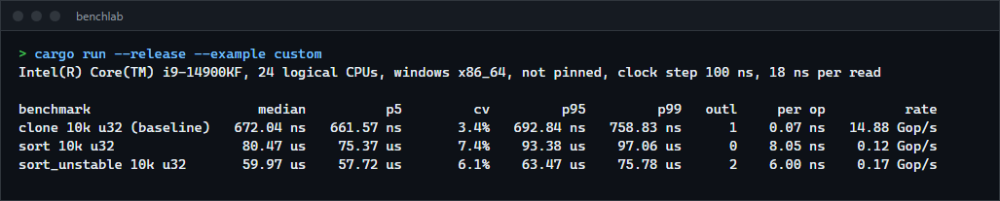
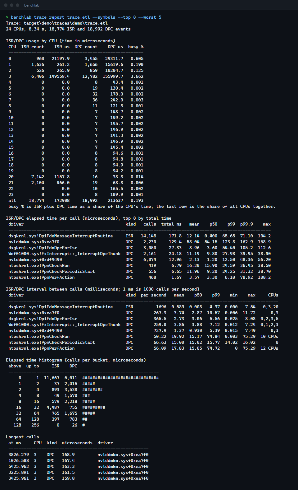
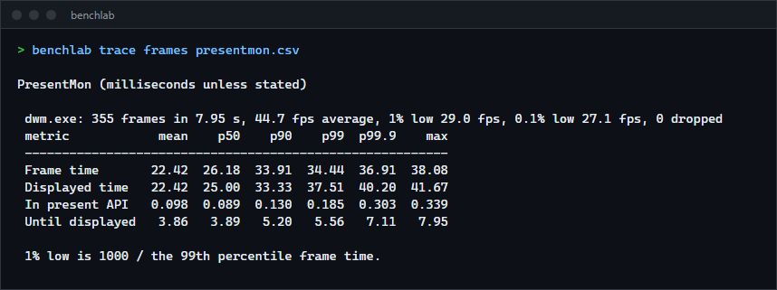

# benchlab

A Rust benchmarking harness and CLI: it calibrates, warms up, takes repeated samples, reports percentiles and outliers, can pin the measuring thread to one CPU, saves every raw sample as JSON and flags regressions between two runs with a significance test. It ships with CPU, memory and cache microbenchmarks. On Windows it also records kernel traces with xperf (and opens them in WPA), reports which drivers spend time in ISRs and DPCs, and can capture PresentMon frame data at the same time. For anyone who wants trustworthy timings for their own code, a quick picture of what their machine does, or an easy way to find what is hurting latency.

**Status:** v0.2.0, working on Windows. The Linux code (CPU pinning, CPU name) is compile-checked but was not run. Not published to crates.io.



## Features

- Warm-up and calibration: the closure runs for the warm-up period while the harness works out how many calls fit in one sample, so each sample lasts about 10 ms regardless of how fast the code is.
- Statistics per benchmark: median, mean, standard deviation, MAD, p1 to p99, IQR, coefficient of variation.
- Outliers counted with Tukey's fences (mild beyond 1.5 IQR, severe beyond 3 IQR), and optionally trimmed before summarising.
- CPU pinning (`--pin CPU`) so a hybrid CPU cannot move the measurement between a fast and a slow core.
- JSON reports with every raw sample and a description of the machine.
- `compare`: median change plus a Mann-Whitney U test on the raw samples; exits 1 on a significant regression, so it can gate CI.
- Built-in microbenchmarks: CPU latency and throughput, memory read, write and copy bandwidth, and a pointer-chase latency curve across working-set sizes from 4 KiB to 256 MiB.
- Usable as a library for your own benchmarks.
- `benchlab trace` (Windows): one-command kernel traces with xperf, a DPC/ISR report per driver and function, PresentMon frame statistics, trace merging and opening in WPA. See [Kernel traces](#kernel-traces-with-xperf-wpa-and-presentmon).

## How to install

Requires a recent stable Rust (built and tested with 1.98.1).

```sh
git clone https://github.com/r3clusionn/bench-framework
cd bench-framework
cargo install --path .
```

Or run it in place with `cargo run --release -- run`. Always build with `--release`.

## How to use

```sh
benchlab list                                  # the built-in benchmarks
benchlab info                                  # machine, clock step and cost of reading the clock
benchlab run --pin 2 --json base.json          # run everything, pinned to logical CPU 2
benchlab run cache mem/read --samples 100      # only names that contain "cache" or "mem/read"
benchlab compare base.json new.json            # exit status 1 if anything regressed
```

| Option of `run` | What it does |
|---|---|
| `FILTER...` | Run only benchmarks whose name contains one of the strings. |
| `--samples N` | Samples per benchmark (default 50). |
| `--sample-time MS` | Target duration of one sample (default 10). |
| `--warmup MS` | Warm-up per benchmark (default 200). |
| `--max-time MS` | Stop a slow benchmark after this long, keeping at least 10 samples (default 5000). |
| `--pin CPU` | Pin the measuring thread to this logical CPU. |
| `--outliers keep\|trim\|trim-severe` | Drop outliers before summarising (default `keep`). |
| `--json FILE` | Save the full report. |

| Option of `compare` | What it does |
|---|---|
| `--threshold PCT` | Smallest median change that counts (default 5). |
| `--alpha P` | Significance level (default 0.01). |

A comparison says `REGRESSED` or `improved` only when the median moved by more than the threshold and the samples are significantly different. A large shift with overlapping samples is `inconclusive`. Exit status is 0 when nothing regressed, 1 when something did, 2 on an error such as an unreadable report.



*The screenshot compares the same code on two different cores of one machine (CPU 2 against CPU 20, an E-core), which is why almost everything regressed. It is a demonstration of the report, not a code change.*

### As a library

```rust
use benchlab::{Config, Suite, Throughput};

let mut suite = Suite::new(Config::default());
suite.bench_throughput("sort_unstable 10k", Throughput::Elements(10_000), || {
    let mut v = data.clone();
    v.sort_unstable();
    v
});
let report = suite.into_report();
report.save(std::path::Path::new("report.json")).unwrap();
```

The closure's return value goes through `black_box`, so the work is not optimised away. `examples/custom.rs` is a complete program that benchmarks two sorts against a clone baseline.



## Kernel traces with xperf, WPA and PresentMon

`benchlab trace` makes the usual latency investigation a few commands: record, read the summary, and open the trace in Windows Performance Analyzer only if the summary shows something worth a closer look. It needs the Windows Performance Toolkit (`xperf.exe` and `wpa.exe`, part of the Windows ADK) and, for recording, an elevated terminal. Reading an existing `.etl` needs neither.



```sh
benchlab trace check                          # which tools were found, can this terminal record
benchlab trace record --delay 3 --timed 10    # 3 s to get ready, then 10 s, then the report
benchlab trace record --preset latency --presentmon --process game.exe --timed 30 --open-wpa
benchlab trace report traces\20261002-131500\trace.etl --symbols --top 20
benchlab trace merge a.etl b.etl -o merged.etl
benchlab trace open trace.etl --symbols       # WPA, with a symbol path set
benchlab trace stop                           # a trace was left running
```

`record` writes one folder per trace, named by `--session` (default: the UTC date and time), under `--out-dir` (default `traces`):

| File | Content |
|---|---|
| `trace.etl` | The merged trace, ready for WPA (xperf's `-d` stop-and-merge adds the driver and process information). |
| `report.txt`, `report.json` | The report below, as text and as data. |
| `presentmon.csv` | PresentMon's raw frames, when `--presentmon` was used. |

| Option of `trace record` | What it does |
|---|---|
| `--preset NAME` | `dpc` (default, small), `latency`, `cpu`, `disk`, `power` or `full`. `benchlab trace presets` lists the kernel flags and stack walks of each. |
| `--flags A+B`, `--stackwalk A+B`, `--no-stacks` | Your own kernel flags and stack walk events instead of a preset's. Flags are validated against xperf's list before anything starts. |
| `--delay S`, `--timed S` | Wait before starting; stop automatically. Without `--timed` it records until Enter or Ctrl+C, and both stop the trace cleanly. |
| `--out-dir DIR`, `--session NAME` | Where the trace goes. A session name that could escape the folder is refused. |
| `--presentmon [PATH]`, `--process EXE` | Run PresentMon alongside. It is not bundled: pass its path, set `PRESENTMON`, or put it on `PATH`. PresentMon 1.x and 2.x argument styles are both handled. |
| `--symbols`, `--functions` | Group by function instead of by driver (`--symbols` resolves real names, `--functions` gives `driver+offset`). |
| `--open-report`, `--open-wpa` | Open the report in the default editor, and the trace in WPA. |
| `--force` | Stop a kernel trace that is already running first. |

The report has these sections:

| Section | What it tells you |
|---|---|
| ISR/DPC usage by CPU | For each CPU, the number of ISRs and DPCs, the time they took, and the share of that CPU's time. |
| Elapsed time per call, by driver | Count, total, mean, p50, p99, p99.9 and max of how long one call ran. High p99.9 or max values point at drivers that delay everything else on that CPU. |
| Interval between calls | How often each driver's routines run (1 ms is 1000 times per second), with calls per second and the CPUs they run on. |
| Histogram | Calls per power-of-two bucket of elapsed time. |
| Longest calls | The slowest ISRs and DPCs with their time in the trace, CPU and driver. |
| PresentMon | Per application: frames, average FPS, 1% and 0.1% low FPS (1000 over the p99 and p99.9 frame time), dropped frames, and mean, p50, p90, p99, p99.9 and max of every frame metric PresentMon reported (frame time, CPU and GPU busy and wait, displayed time, latencies). `benchlab trace frames file.csv` prints just this. |



The report format follows what [xtw](https://github.com/valleyofdoom/xtw) describes in its README (usage by CPU, interval, elapsed time, PresentMon). No code from xtw was used. The reader below was written from the ETW documentation and checked against xperf's own output.

### How the trace is read

xperf records and merges, but `benchlab` reads the `.etl` file itself with the Windows trace consumer API. xperf's text output has a resolution of one microsecond, so an ISR that runs for 300 ns shows as 0. The kernel stamps each DPC and ISR with its start (`InitialTime`) and the event with its end; both are performance-counter ticks (100 ns here), and the difference is the duration. Drivers are found by looking the routine's address up in the kernel image-load events of the trace.

`--symbols` names the routine with DbgHelp (`dxgkrnl.sys!DpiFdoDpcForIsr` instead of `dxgkrnl.sys`). It needs a `dbghelp.dll` with `symsrv.dll` beside it (Debugging Tools for Windows or WinDbg; set `BENCHLAB_DBGHELP` to its folder if it is not found), downloads PDBs from Microsoft's symbol server into `%LOCALAPPDATA%\benchlab\symbols` (or uses `_NT_SYMBOL_PATH`), and only uses a driver file whose `TimeDateStamp` equals the one in the trace. Drivers without public symbols, such as NVIDIA's, stay `driver+offset`; the nearest export is never shown as if it were the function.

A merged trace covers the wall-clock span of all its parts, so rates (calls per second) of two traces recorded minutes apart are diluted by the gap. Merge traces recorded at the same time.

## The built-in benchmarks

| Group | Benchmarks | What they show |
|---|---|---|
| `cpu` | `int-latency`, `int-throughput`, `fp-latency`, `fp-throughput` | A chain of dependent steps against 8 independent chains of the same step: latency against instruction-level parallelism. Per op is one step. |
| `mem/read` | 32 KiB, 1 MiB, 32 MiB, 256 MiB | Sequential sum of a buffer, in GB/s (10^9 bytes per second). |
| `mem/write` | the same sizes | Sequential fill. |
| `mem/copy` | 1 MiB, 256 MiB | `copy_from_slice`. The rate counts bytes copied, not read plus written. |
| `cache/chase` | 4 KiB to 256 MiB in 10 steps | Dependent loads through a random cycle of cache lines: per op is the load latency, and the steps in the curve are the cache levels. |

## Results

Measured with `benchlab run --pin 2` (release build, generic x86-64 target, so memory loops use SSE2) on an Intel Core i9-14900KF, Windows 11, Rust 1.98.1, while other programs were running. In a pair of full runs, 23 of the 24 medians agreed within 3 percent; the 1 MiB copy differed by 12 percent, and the 16 MiB load-latency test varied by 9 to 37 percent between samples, so treat those two as rough. Samples are 50 per benchmark of about 10 ms each.

| Benchmark | Result |
|---|---|
| Integer step, dependent chain / 8 chains | 0.79 ns / 0.20 ns per step (4 times more with independent work) |
| f64 multiply-add, dependent chain / 8 chains | 1.36 ns / 0.17 ns per step |
| Sequential read at 32 KiB / 1 MiB / 32 MiB / 256 MiB | 130 / 118 / 35.8 / 24.0 GB/s |
| Sequential write at the same sizes | 318 / 82 / 39 / 19 GB/s |
| Copy at 1 MiB / 256 MiB | 69 / 18.6 GB/s |
| Load latency, working set 4 to 32 KiB | 1.19 ns |
| Load latency, 64 to 256 KiB / 1 MiB | 3.3 ns / 4.2 ns |
| Load latency, 4 MiB / 16 MiB | 13.4 ns / 18.2 ns |
| Load latency, 64 MiB / 256 MiB | 76.7 ns / 85.1 ns |

The latency steps line up with this CPU's caches (48 KiB L1 data, 2 MiB L2 per P-core, 36 MiB shared L3): the jumps are at 64 KiB, 4 MiB and 64 MiB. The 64 MiB and 256 MiB figures include page-table misses, because the buffers use ordinary 4 KiB pages.

## How it works

- **Calibration.** During the warm-up the batch size doubles until a batch takes a few milliseconds, then is scaled so one sample lasts the target time. The clock on Windows ticks every 100 ns (`benchlab info` measures it), so samples must be far longer than that.
- **Samples are per call.** Each sample is the time of a batch divided by its call count, so a 10 ms sample of a 20 ns function averages half a million calls. Every sample is kept in the report.
- **Summary.** Percentiles use linear interpolation between ranks (NumPy's default). The summary is computed after the outlier policy has been applied, and the outlier counts are always computed on all samples.
- **Regression test.** The Mann-Whitney U test makes no assumption that timings are normally distributed, which they rarely are. It uses the normal approximation with tie and continuity corrections, so very small samples (under about 8) are not reliable.
- **Pinning.** Windows `SetThreadAffinityMask` (first 64 logical CPUs) and Linux `sched_setaffinity`, declared directly with no extra crate.

## Verification

- `cargo test --release` runs 52 unit tests, 10 harness tests, 2 oracle tests, a live trace test and a doc test. The harness tests check that calibration lands within the target (a 100 us busy loop gives 35 to 60 calls per 5 ms sample and a median of 98 to 130 us), the time cap, the JSON round trip, the compare verdicts (including a real 100 us against 150 us busy loop, and identical code not being flagged), pinning (the thread stays on the requested CPU, read back with `GetCurrentProcessorNumber`), and the CLI exit codes.
- The statistics are checked against NumPy 2.5.3 and SciPy 1.18.1 (`scripts/make_oracle.py` writes `tests/oracle.json`): mean, standard deviation, MAD, seven percentiles and the four outlier counts on 9 data sets, and the U statistic and p-value of `mannwhitneyu` on 5 pairs including tied data. They match to a relative 1e-9.
- The harness tests were run 15 times in a row without a failure.
- The live trace test records 3 seconds of kernel trace (it skips itself without administrator rights or xperf), decodes the same file with `xperf -a dumper`, and requires the same number of DPCs and ISRs on every CPU, the same DPC count for every driver both tools can name, and the same total time within xperf's one-microsecond rounding. It passed on this machine (about 10,000 DPCs and 9,500 ISRs in a 4 second trace). Breaking the image-name offset or dropping the message-signalled interrupt opcode on purpose makes it fail.
- While building the trace reader, comparing with xperf showed it was missing 7,249 of 9,583 ISRs: message-signalled interrupts use a second opcode. The test above is what caught it.
- PresentMon statistics were checked against an independent Python calculation of the raw CSV (frame count, mean, p50, p90, p99, p99.9, max, FPS and 1% low agree).
- While building the integer benchmark, the first version (`x * k + 1` repeated) measured shorter than a multiply plus an add can take, because integer multiply-add chains can be algebraically merged by the compiler. It was replaced with a multiply, shift and xor step that cannot be merged, and the latency rose from 0.57 ns to 0.76 ns.

### Trace results

On an Intel Core i9-14900KF, Windows 11, Windows Performance Toolkit 10.0.26100, five runs each:

| Task | Time |
|---|---|
| `benchlab trace report` on a 47 MB trace (8 s, 24 CPUs, DPC, ISR, context switches and CPU samples with stacks) | 30 ms median (29 to 50) |
| `xperf -a dumper` on the same trace | 2,040 ms median |
| `xperf -a dpcisr` on the same trace | 119 ms median |

`record --timed 8` takes 9.1 seconds from start to report with either the `dpc` or the `latency` preset (one run each), so stopping, merging and reporting add about a second. The traces were 29 MB and 46 MB.

## Limits

- Wall-clock time only: no cycle counters, no hardware counters, no allocation tracking.
- Measures a closure in a loop; there is no per-iteration setup or teardown hook, so state that must be rebuilt every call is part of the measurement (see the clone baseline in the example).
- The microbenchmarks are compiled for generic x86-64. Building with `RUSTFLAGS="-C target-cpu=native"` raises the in-cache read and write rates.
- On Windows pinning covers the first 64 logical CPUs (one processor group).
- Linux and macOS were not run. The Linux build was compile-checked for `x86_64-unknown-linux-musl`; `benchlab trace` is Windows only.
- Traces are read for DPC, ISR and driver-load events only. Context switches, CPU samples, disk and the rest are in the file for WPA, not in the report.
- Tracing has overhead and uses the one NT Kernel Logger session Windows allows: recording fails (with a clear message) when another tool owns it, and `--force` stops that other session.
- ISR and DPC time is the kernel's own measurement of the routine; it does not include the interrupt latency before the routine started.
- The trace reader supports traces that use the performance counter or system time as their clock, not the CPU cycle counter.

## License

MIT (see `LICENSE`).
